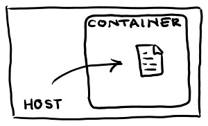
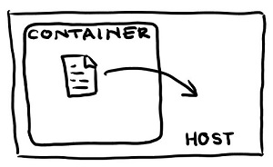

# `docker cp` command

## Copying a file from the host machine to a Docker container



```
$ docker cp /host/path/target:<containerId>/file/path/within/container
```

Create a file with some content:

```
$ echo "Hello World" > hello.txt
```

Run a new container where the file will be copied to:

```
$ docker run --rm -it -d alpine /bin/sh
```

Copy the file from the host machine to the Docker container:

```
$ docker cp hello.txt <container-id>:/tmp/hello.txt
```

Read the content of the file that is now within the Docker container:

```
$ docker exec -it <container-id> cat /tmp/hello.txt
```

## Copying a file from a Docker container to the host machine



```
$ docker cp <containerId>:/file/path/within/container /host/path/target
```

In this example you are going to run a container whose task is to generate a log file that will record the current time every second.

```
$ docker run -d --rm alpine /bin/sh -c 'while true; do echo $(date) >> /tmp/date.log; sleep 1; done'
```

Verify the file has been created and it has some content:

```
$ docker exec -it <container-id> cat /tmp/date.log
```

Copy the file from the container to the host machine:

```
$ docker cp <container-id>:/tmp/date.log date.log
```
